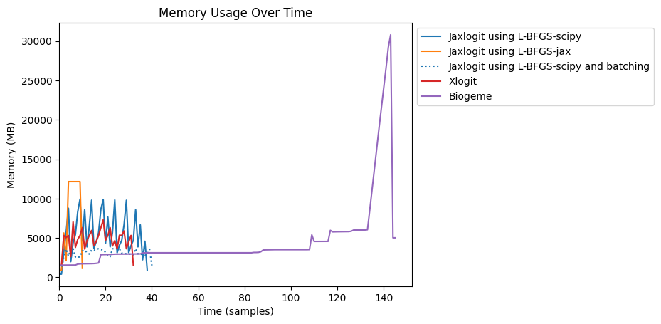
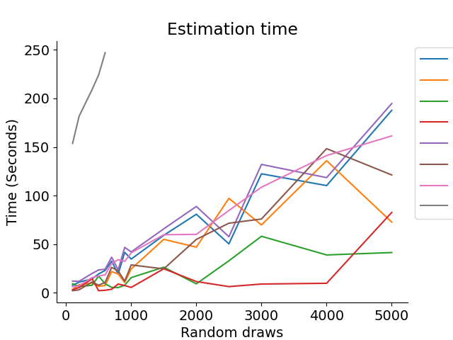

# Jaxlogit
MSLE estimation of linear-in-parameters mixed logit models. This package is based on [xlogit](https://github.com/arteagac/xlogit), with the core computational engine replaced by [jax](https://github.com/jax-ml/jax). Additionally, the documentation structure and many examples are adapted from `xlogit`'s documentation.
This package is work-in-progress and the API might change without notice. 


## Why use Jaxlogit?
While there are many packages out there that can compute mixed logit models, jaxlogit is unique in its processing speed and capabilities, which come from using jax and just in time compilation. You can see the comparison [here](https://github.com/outerl/jaxlogit/blob/main/examples/mixed_logit_comparison_example.ipynb). Because jaxlogit specialises in linear models, it can use accelerated linear algebra to do the matrix multiplication, which significantly increases the speed. Jaxlogit can also work with large quanities of data by calculating them in batches, reducing memory load. This can be seen in [this example](https://outerl.github.io/jaxlogit/example_notebooks/batching_example.html).


## Quick Start
This example uses `jaxlogit` to to estimate a mixed logit model for choices of transport method using the swissmetro dataset. It contains stated-preferences for three alternative transportation modes that include car, train and a newly introduced mode: the swissmetro. The dataset is available [here](http://transp-or.epfl.ch/data/swissmetro.dat) and [Bierlaire et. al., (2001)](https://transp-or.epfl.ch/documents/proceedings/BierAxhaAbay01.pdf) provides a detailed discussion of the data as well as its context and collection process. 

The explanatory variables are cost and travel time of each of the alternatives, as well as alternative-specific constraints to represent unobserved factors. New functionality used compared to xlogit is considering the correlation between the distributions of explanatory variables. In this example, only correlations between some variables are considered, and some are set to certain values, according to research done in [J. Walker's PhD thesis (MIT 2001)](https://transp-or.epfl.ch/courses/dca2012/WalkerPhD.pdf). This is specified by specifying some correlation parameters to be 0. 

The data must be in long format. Wide format data can be transformed into long format data using the ``wide_to_long`` function.

**Required parameters:**
* ``X``: 2-D array of input data (in long format) with choice situations as rows, and variables as columns
* ``y``: 1-D array of choices (in long format)
* ``varnames``: List of variable names that matches the number and order of the columns in ``X``
* ``alts``:  1-D array of alternative representing the alternative chosen for each input
* ``ids``:  1-D array of the ids of the choice situations
* ``randvars``: dictionary of variables and their mixing distributions. In this example, only ``"n"`` normal variables are used. Valid distributions are ``"n"`` normal, ``"ln"`` log normal and ``"n_trunc"`` truncated normal.

**Optional Parameters in this example:**
* ``avail``: 2-D array of availability of alternatives for the choice situations. One when available or zero otherwise.
* ``panels``: 1-D array of ids for panel formation, where each choice situation has a panel for each variable 
* ``set_vars``: Dictionary specifying some variables and the values that they are to be set
* ``include_correlations``: Boolean whether or not to consider correlation between variables
* ``optim_method``: String representing with optimisation method to use. Options are ``"L-BFGS-scipy"``, ``"BFGS-scipy"``, ``"L-BFGS-jax"``, and ``"BFGS-jax"``. Scipy uses the standard scipy library and jax uses jax's scipy library, which is significantly faster (may not work with batching) but may not be maintained and potentially discontinued without notice.


```python
import pandas as pd
import numpy as np
import jax

from jaxlogit.mixed_logit import MixedLogit, ConfigData


#  64bit precision
jax.config.update("jax_enable_x64", True)

# read and format data
df_wide = pd.read_table("http://transp-or.epfl.ch/data/swissmetro.dat", sep='\t')

# Keep only observations for commute and business purposes that contain known choices
df_wide = df_wide[(df_wide['PURPOSE'].isin([1, 3]) & (df_wide['CHOICE'] != 0))]

df_wide['custom_id'] = np.arange(len(df_wide))  # Add unique identifier
df_wide['CHOICE'] = df_wide['CHOICE'].map({1: 'TRAIN', 2:'SM', 3: 'CAR'})

from jaxlogit.utils import wide_to_long

df = wide_to_long(df_wide, id_col='custom_id', alt_name='alt', sep='_',
                  alt_list=['TRAIN', 'SM', 'CAR'], empty_val=0,
                  varying=['TT', 'CO', 'HE', 'AV', 'SEATS'], alt_is_prefix=True)

# modification of data to include
df['ASC_TRAIN'] = np.ones(len(df))*(df['alt'] == 'TRAIN')
df['ASC_CAR'] = np.ones(len(df))*(df['alt'] == 'CAR')
df['TT'], df['CO'] = df['TT']/100, df['CO']/100  # Scale variables
annual_pass = (df['GA'] == 1) & (df['alt'].isin(['TRAIN', 'SM']))
df.loc[annual_pass, 'CO'] = 0  # Cost zero for pass holders

# specification of variables
varnames=['ASC_CAR', 'ASC_TRAIN', 'ASC_SM', 'CO', 'TT']

randvars={'ASC_CAR': 'n', 'ASC_TRAIN': 'n', 'ASC_SM': 'n'}
set_vars = {
    'ASC_SM': 0.0, 'sd.ASC_TRAIN': 1.0, 'sd.ASC_CAR': 0.0,
    'chol.ASC_CAR.ASC_TRAIN': 0.0, 'chol.ASC_CAR.ASC_SM': 0.0
}  # Identification of error components, see J. Walker's PhD thesis (MIT 2001)

# change some optional arguments
config = ConfigData(
    avail=df['AV'],
    panels=df["ID"],
    set_vars=set_vars,
    include_correlations=True,  # Enable correlation between random parameters
    optim_method="L-BFGS-scipy"
)


model = MixedLogit()
res = model.fit(
    X=df[varnames],
    y=df['CHOICE'],
    varnames=varnames,
    alts=df['alt'],
    ids=df['custom_id'],
    randvars=randvars,
    config=config
)
model.summary()
```


            Message: CONVERGENCE: RELATIVE REDUCTION OF F <= FACTR*EPSMCH
            Iterations: 17
            Function evaluations: 21
        Estimation time= 57.3 seconds
        ---------------------------------------------------------------------------
        Coefficient              Estimate      Std.Err.         z-val         P>|z|
        ---------------------------------------------------------------------------
        ASC_CAR                -0.2279764     0.4655508    -0.4896917         0.624    
        ASC_TRAIN              -1.1966263     0.5873328    -2.0373905        0.0416 *  
        ASC_SM                  0.1000000     0.0000000           inf             0 ***
        CO                     -2.0490264     0.3444999    -5.9478289      2.85e-09 ***
        TT                     -2.1429727     0.6607183    -3.2433986       0.00119 ** 
        sd.ASC_CAR              0.1000000     0.0000000           inf             0 ***
        sd.ASC_TRAIN            0.1000000     0.0000000           inf             0 ***
        sd.ASC_SM               2.4459162     0.2814464     8.6905216      4.47e-18 ***
        chol.ASC_CAR.ASC_TR     0.1000000     0.0000000           inf             0 ***
        chol.ASC_CAR.ASC_SM     0.1000000     0.0000000           inf             0 ***
        chol.ASC_TRAIN.ASC_     0.6937107     0.2260149     3.0693135       0.00215 ** 
        ---------------------------------------------------------------------------
        Significance:  0 '***' 0.001 '**' 0.01 '*' 0.05 '.' 0.1 ' ' 1

        Log-Likelihood= -4071.438
        AIC= 8154.876
        BIC= 8195.795

If out of memory, the data can be batched as well.

## Quick Install

Currently available on test PyPI `pip install -i https://test.pypi.org/simple/ jaxlogit`.

Alternatively, clone the [repo](https://github.com/outerl/jaxlogit).

## Benchmark
As shown in the plot below, jaxlogit with batching uses significantly less memory than xlogit. The results were obtained using an AMD Ryzen 9 600HX graphics card with (?)GB RAM.


The default method is 'L-BFGS-B' or 'L-BFGS'. Where a b is appended to the label, the 'BFGS' method was used.

In the memory graph...

In the timing graph, it can be seen that batching does not have a significant impact on time taken. Additionally, the jaxlogit performs much faster when using the experimental jax methods. The time for standard scipy method and xlogit are quite comparable. Biogeme is slower than xlogit and any form of jaxlogit.
